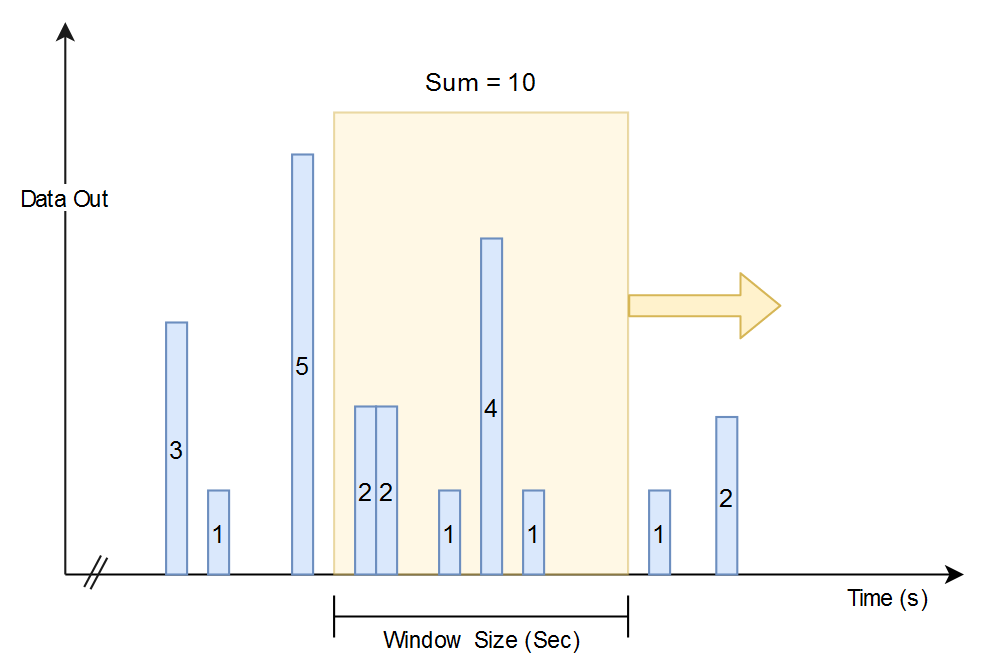
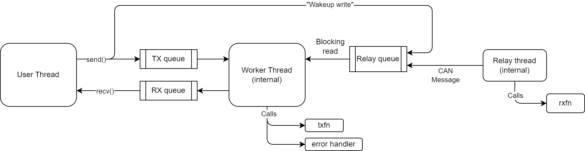

Implementation
==============

This sections explains the python implementation of the IsoTP protocol.

Transport layer
---------------

Depending on your constraints, you may want to have the IsoTP protocol layer to run in Python (in the user space). For example, if you want to rely on `python-can <https://python-can.readthedocs.io/>`_ for the support of your CAN interface, you will need to run the IsoTP layer in Python.

In such case, the :class:`isotp.TransportLayer<isotp.TransportLayer>` will be the right tool. One must first define functions to access the hardware and provide them to the :class:`isotp.TransportLayer<isotp.TransportLayer>` as parameters named ``rxfn`` and ``txfn``.

.. autoclass:: isotp.TransportLayer

If python-can must be used as CAN layer, one can use the :class:`isotp.CanStack<isotp.CanStack>` and :class:`isotp.NotifierBasedCanStack<isotp.NotifierBasedCanStack>` which extends the TransportLayer object with predefined functions that calls python-can. 

.. autoclass:: isotp.CanStack
.. autoclass:: isotp.NotifierBasedCanStack

The CAN messages going in and out from the transport layer are defined with :class:`isotp.CanMessage<isotp.CanMessage>`. 

.. autoclass:: isotp.CanMessage

-----

.. _parameters:

Parameters
----------

The transport layer ``params`` parameter must be a dictionary with the following keys.

.. _param_stmin:

.. attribute:: stmin
   :annotation: (int)

   **default: 0**

   The single-byte Separation Time to include in the flow control message that the layer will send when receiving data. 
   Refer to ISO-15765-2 for specific values. From 1 to 127, represents milliseconds. From 0xF1 to 0xF9, represents hundreds of microseconds (100us, 200us, ..., 900us). 
   0 Means no timing requirements

.. _param_blocksize:

.. attribute:: blocksize
   :annotation: (int)

   **default: 8**

   The single-byte Block Size to include in the flow control message that the layer will send when receiving data.
   Represents the number of consecutive frames that a sender should send before expecting the layer to send a flow control message. 
   0 means infinitely large block size (implying no flow control message)

.. _param_tx_data_length:

.. attribute:: tx_data_length
   :annotation: (int)

   **default: 8**

   The maximum number of bytes that the Link Layer (CAN layer) can transport. In other words, the biggest number of data bytes possible in a single CAN message.
   Valid values are : 8, 12, 16, 20, 24, 32, 48, 64.
   
   Large IsoTP frames will be transmitted in small CAN messages of this size except for the last CAN message that will be as small as possible, unless padding is used. 

.. _param_tx_data_min_length:

.. attribute:: tx_data_min_length
   :annotation: (int)

   **default: None**

   Sets the minimum length of CAN messages. Message with less data than this value will be padded using ``tx_padding`` byte or ``0xCC`` if ``tx_padding=None``. 

   When set to ``None``, CAN messages will be as small as possible unless ``tx_data_length=8`` and ``tx_padding != None``; in that case, all CAN messages will be padded up 
   to 8 bytes to be compliant with ISO-15765.

   Valid values are : 1, 2, 3, 4, 5, 6, 7, 8, 12, 16, 20, 24, 32, 48, 64.
   
.. _param_override_receiver_stmin:

.. attribute:: override_receiver_stmin
   :annotation: (float or None)

   **default: None**

    Time in seconds to wait between consecutive frames when transmitting. When set, this value will override the receiver ``stmin`` requirement. When ``None``, the receiver
    ``stmin`` parameter will be respected. This parameter can be useful to speed up a transmission by setting a value of 0 (send as fast as possible) on a system that has low 
    execution priority or coarse thread resolution.  

    This parameter replace the ``squash_stmin_requirement`` parameter available in v1.x
   

.. _param_rx_flowcontrol_timeout:

.. attribute:: rx_flowcontrol_timeout
   
   **default: 1000**

   The number of milliseconds to wait for a flow control frame before stopping reception and triggering a :class:`FlowControlTimeoutError<isotp.FlowControlTimeoutError>`.
   Defined as **N_BS** bs ISO-15765-2

.. _param_rx_consecutive_frame_timeout:

.. attribute:: rx_consecutive_frame_timeout
   :annotation: (int)

   **default: 1000**

   The number of milliseconds to wait for a consecutive frame before stopping reception and triggering a :class:`ConsecutiveFrameTimeoutError<isotp.ConsecutiveFrameTimeoutError>`.
   Defined as **N_CS** by ISO-15765-2

.. _param_tx_padding:

.. attribute:: tx_padding
   :annotation: (int or None)

   **default: None**

   When not ``None`` represents the byte used for padding messages sent. No padding applied when ``None`` unless ``tx_data_min_length`` is set or CAN FD mandatory padding is required.

.. _param_wftmax:

.. attribute:: wftmax
   :annotation: (int)

   **default: 0**

   The single-byte "Wait Frame Max" to include in the flow control message that the layer will send when receiving data. 
   When this limits is reached, reception will stop and trigger a :class:`MaximumWaitFrameReachedError<isotp.MaximumWaitFrameReachedError>`

   A value of 0 means that wait frames are not supported and none shall be sent.

.. _param_max_frame_size:

.. attribute:: max_frame_size
   :annotation: (int)

   **default: 4095**

   The maximum frame length that the stack will accept to receive. ISO-15765-2:2016 allows frames as long as 2^32-1 (4294967295 bytes). When a FirstFrame is sent with a length longer than ``max_frame_size``, the message will be ignored, a FlowControl message with FlowStatus=2 (Overflow) will be sent and a :class:`FrameTooLongError<isotp.FrameTooLongError>` will be triggered.

   This parameter mainly is a protection to avoid crashes due to lack of memory (caused by an external device).

.. _param_can_fd:

.. attribute:: can_fd
   :annotation: (bool)

   **default: False**

   When set to ``True``, transmitted messages will be CAN FD. CAN 2.0 when ``False``.

   Setting this parameter to ``True`` does not change the behavior of the :class:`TransportLayer<isotp.TransportLayer>` except that outputted message will have their ``is_fd`` property set to ``True``. This parameter is just a convenience to integrate more easily with python-can

.. _param_bitrate_switch:

.. attribute:: bitrate_switch
   :annotation: (bool)

   **default: False**

   When set to ``True``, tx message will have a flag ``bitrate_switch`` marked as ``True``, meaning that the underlying layer shall perform a CAN FD bitrate switch after arbitration phase.

   Setting this parameter to ``True`` does not change the behavior of the :class:`TransportLayer<isotp.TransportLayer>` except that outputted message will have their ``bitrate_switch`` property set to ``True``. This parameter is just a convenience to integrate more easily with python-can

.. _param_default_target_address_type:

.. attribute:: default_target_address_type
   :annotation: (int)

   **default: Physical (0)**

   When using the :meth:`TransportLayer.send<isotp.TransportLayer.send>` method without specifying ``target_address_type``, the value in this field will be used.
   The purpose of this parameter is to easily switch the address type if an application is not calling ``send()`` directly; for example, if you use a library
   that interact with the :class:`TransportLayer<isotp.TransportLayer>` object (such as a UDS client).

   Can either be :class:`Physical (0)<isotp.TargetAddressType>` or :meth:`Functional (1)<isotp.TargetAddressType>`

.. _param_rate_limit_enable:

.. attribute:: rate_limit_enable
   :annotation: (bool)

   **default: False**

   Enable or disable the rate limiter. When disabled, no throttling is done on the output rate. When enabled, extra wait states are added in between CAN message transmission to meet ``rate_limit_max_bitrate``

   Refer to :ref:`Rate Limiter Section<rate_limiter_section>` for more details

.. _param_rate_limit_max_bitrate:

.. attribute:: rate_limit_max_bitrate
   :annotation: (int)

   **default: 10000000 b/s**

   Defines the target bitrate in Bits/seconds that the TransportLayer object should try to respect. This rate limiter only apply to the data of the output messages. 

   Refer to :ref:`Rate Limiter Section<rate_limiter_section>` for more details

.. _param_rate_limit_window_size:

.. attribute:: rate_limit_window_size
   :annotation: (float)

   **default: 0.2 sec**

   Time window used to compute the rate limit. The rate limiter algorithm works with a sliding time window. This parameter defines the width of the window.
   The rate limiter ensure that no more than N bits is sent within the moving window where N=(rate_limit_max_bitrate*rate_limit_window_size).

   This value should be at least 50 msec for reliable behavior.

   Refer to :ref:`Rate Limiter Section<rate_limiter_section>` for more details

.. _param_listen_mode:

.. attribute:: listen_mode
   :annotation: (bool)

   **default: False**

   When Listen Mode is enabled, the :class:`TransportLayer<isotp.TransportLayer>` will correctly receive and transmit ISO-TP Frame, but will not send Flow Control
   message when receiving a frame. This mode of operation is useful to listen to a transmission between two third-party devices without interfering. 

.. _param_blocking_send:

.. attribute:: blocking_send
   :annotation: (bool)

   **default: False**

   When enabled, calling :meth:`TransportLayer.send()<isotp.TransportLayer.send>` will block until the whole payload has been passed down to the lower layer.
   In case of failure, a :class:`BlockingSendFailure<isotp.BlockingSendFailure>` exception will be raised.

   .. warning:: This parameter requires the processing of the transport layer to happen in parallel, therefore ``TransportLayer.start()`` must be called prior to ``send()`` or
        a manually generated thread must called ``process()`` as fast as possible.

.. _param_logger_name:

.. attribute:: logger_name
   :annotation: (str)

   **default: "isotp"**

   Sets the name of the logger from the ``logging`` module used to log info and debug information

-----

.. _rate_limiter_section:

Rate Limiter
------------

The :class:`isotp.TransportLayer<isotp.TransportLayer>` transmission rate limiter is a feature that allows to do some throttling on the output data rate. It works with a simple sliding window and
keeps the total amount of bits sent during that time window below the maximum allowed.

The maximum of bits allowed during the moving time window is defined by the product of ``rate_limit_max_bitrate`` and ``rate_limit_window_size``. 
For example, if the target bitrate is 1000b/s and the window size is 0.1sec, then the rate limiter will keep to total amount of bits during a window of 0.1 sec below 100bits.

It is important to understand that this product also defines the maximum burst size that the :class:`isotp.TransportLayer<isotp.TransportLayer>` object will output, and this is actually the original problem the
rate limiter is intended to fix (See `issue #61 <https://github.com/pylessard/python-can-isotp/issues/61>`_). Consider the case where a big payload of 10000 bytes must be transmitted, 
after the transmission of the FirstFrame, the receiving party sends a FlowControl message with BlockSize=0 and STMin=0. In that situation, the whole payload can be sent immediately
but writing 10000 bytes in a single burst might be too much for the CAN driver to handle and may overflow its internal buffer.  In
this situation, it is useful to use the rate limiter to reduces the strain on the driver internal buffer.

In the above scenario, having a bitrate of 80000 bps and a window size of 0.1 sec would make the :class:`isotp.TransportLayer<isotp.TransportLayer>` output a burst of 8000 bits (1000 bytes) every 0.1 seconds.

.. warning:: The bitrate defined by :ref:`rate_limit_max_bitrate<param_rate_limit_max_bitrate>` represent the bitrate of the CAN payload that goes out of the :class:`isotp.TransportLayer<isotp.TransportLayer>` object only, 
    the CAN layer overhead is excluded. 
    Knowing the a classical CAN message with 11bits ID and a payload of 64 bits usually have 111 bits, the extra 47 bits of overhead will not be considered by the rate limiter. This means
    that even if the rate limiter is requested to keep a steady 10kbps, depending on the CAN layer configuration, the effective hardware bitrate measured might be much more significant, from 1 to 1.5x more.

.. warning:: Bitrate is achieved by adding extra wait states which normally translate into OS calls to ``Sleep()``. 
    Because an OS scheduler has a time resolution, bitrate accuracy will be poor if the specified bitrate is very low or if the window size is very small.

-----

Usage
-----

The :class:`isotp.TransportLayer<isotp.TransportLayer>` object has the following methods

.. automethod:: isotp.TransportLayer.start
.. automethod:: isotp.TransportLayer.stop
.. automethod:: isotp.TransportLayer.send
.. automethod:: isotp.TransportLayer.recv
.. automethod:: isotp.TransportLayer.available
.. automethod:: isotp.TransportLayer.transmitting
.. automethod:: isotp.TransportLayer.set_address
.. automethod:: isotp.TransportLayer.stop_sending
.. automethod:: isotp.TransportLayer.stop_receiving

.. warning:: ``set_address`` is not thread safe and should be called before ``start()`` is called.

-----

Legacy methods (v1.x)
---------------------

With isotp v2.x, the processing of the transport layer is done from an internal thread. For backward compatibility, the following methods are still accessible to the
users, but **should not** be called from the user thread if ``start()`` has been called. It is safe to call them if no call to ``start()`` is done. 

Calls to non-thread-safe method (``reset()``, ``process()``) while the internal thread is running will cause an exception to raise.

.. automethod:: isotp.TransportLayer.reset
.. automethod:: isotp.TransportLayer.process
.. automethod:: isotp.TransportLayer.sleep_time
.. automethod:: isotp.TransportLayer.set_sleep_timing

.. note:: The unthreaded transport layer object used in the isotp module v1.x is still accessible under the name :class:`isotp.TransportLayerLogic<isotp.TransportLayerLogic>`.  
    The :class:`isotp.TransportLayer<isotp.TransportLayer>` object is an extension of it that can spawn a thread and calls methods that are were to be called by the user.

    See :ref:`Backward Compatibility<backward_compatibility>`

---------

.. _Errors:

Errors
------

Problem during the transmission/reception are possible. These error are reported to the user by calling a error handler and passing an error object containing the details of the error. 
An error handler should be a callable function that expects an  :class:`isotp.IsoTpError<isotp.IsoTpError>` as first parameter.

.. warning:: The error handler will be called from the internal thread, therefore, any interaction with the application should use a thread safe mechanism

.. function:: my_error_handler(error)

   :param error: The error
   :type error: :class:`isotp.IsoTpError<isotp.IsoTpError>`

All errors inherit :class:`isotp.IsoTpError<isotp.IsoTpError>` which itself inherits :class:`Exception<Exception>`

.. autoclass:: isotp.FlowControlTimeoutError
.. autoclass:: isotp.ConsecutiveFrameTimeoutError
.. autoclass:: isotp.InvalidCanDataError
.. autoclass:: isotp.UnexpectedFlowControlError
.. autoclass:: isotp.UnexpectedConsecutiveFrameError
.. autoclass:: isotp.ReceptionInterruptedWithSingleFrameError
.. autoclass:: isotp.ReceptionInterruptedWithFirstFrameError
.. autoclass:: isotp.WrongSequenceNumberError
.. autoclass:: isotp.UnsupportedWaitFrameError
.. autoclass:: isotp.MaximumWaitFrameReachedError
.. autoclass:: isotp.FrameTooLongError
.. autoclass:: isotp.ChangingInvalidRXDLError
.. autoclass:: isotp.MissingEscapeSequenceError
.. autoclass:: isotp.InvalidCanFdFirstFrameRXDL
.. autoclass:: isotp.OverflowError
.. autoclass:: isotp.BadGeneratorError

----------

.. _exceptions:

Exceptions
----------

Some exception can be raised in special cases. These are never sent to the error handler

.. autoclass:: isotp.BlockingSendFailure
.. autoclass:: isotp.BlockingSendTimeout

.. note:: ``BlockingSendTimeout`` inherits ``BlockingSendTimeout``. Catching a ``BlockingSendFailure`` will also catch timeouts

--------

.. _about_timings:

About timings
-------------

Timing management is a complex subject and has been the source of a lot of discussions in Github issue tracker. v1.x had many timing-related flaws that were addressed in v2.x.
Still, reaching good timing with the pure python :class:`TransportLayer<isotp.TransportLayer>` object is not an easy task, mainly because of the 2 following facts
 
 1. Timing depends on the OS scheduler
 2. The transport layer is not tightly coupled with the underlying layers (``rxfn`` is user provided)

The fact #2 is useful for compatibility, allowing to couple the isotp layer with any kind of link layer. Unfortunately, it has the drawback of preventing cross-layer optimizations.
For that reason, this module employs a 3 thread strategy and rely on the python ``Queue`` object for synchronization. The python ``Queue`` module employ OS primitives for synchronization, such
as condition variables to pass control between threads, which are as performant as they can be. 

See the following figure

- The relay thread reads the user provided ``rxfn`` in a loop and fills the relay queue when that callback returns a value different from ``None``
- The worker thread interact with the user by doing non-blocking reads to the Rx Queue
- The worker thread does blocking reads to the relay queue and gets woken up right away by Python when a message arrives
- When the user calls ``send()``, a ``None`` is injected in the relay queue, forcing the worker thread to wake up and process the user provided payload right away.

Using the approach described above, a message can be read from the link-layer and processed after 2 context switches, which are achievable in about 20us each on both Windows and Linux. This
40us latency is far better than the latency caused by calls to ``time.sleep()`` required with v1.x. Considering that a CAN bus running at 500kbps has a message duration of about 230us,
the latency is in the acceptable range.

--------

.. _backward_compatibility:

Backward compatibility
----------------------

For backward compatibility with v1.x, the :class:`isotp.TransportLayer<isotp.TransportLayer>` is an extension of the v1.x transport layer, which has been renamed to ``TransportLayerLogic``.
In v1.x, the user had to handle timing and repeatedly call the ``process()`` method. To avoid breaking applications using that approach, the :class:`isotp.TransportLayer<isotp.TransportLayer>` inherits
``TransportLayerLogic``, therefore the old interface is still accessible under the same name. Inheritance is used instead of composition for that purpose.

When calling ``start()`` and ``stop()``, which have been added in the 2.x extension, it is assumed that the user will uses the TransportLayer as documented by the v2.x documentation,
otherwise race conditions could occur. Put simply, ``process()`` should never be called after ``start()`` has been called, otherwise, an exception will be raised.

